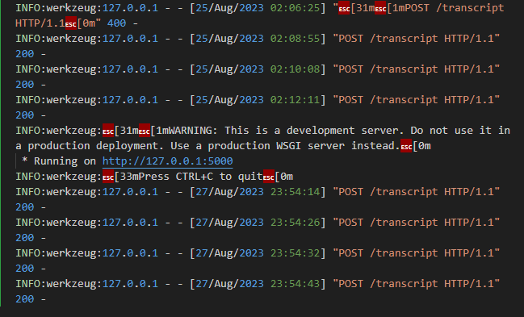
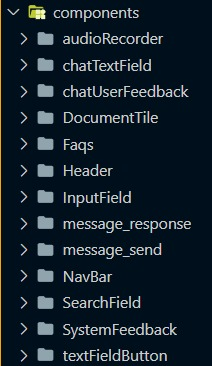

# Inteli - Instituto de Tecnologia e Liderança 

 

# Automação com reconhecimento por voz

Nome do Projeto: Automação com reconhecimento por voz

Nome do Parceiro: IBM

Nome do Grupo: Talk to Watson

Integrantes do grupo: 
- Alexandre Fonseca de Souza
- Ana Clara Loureiro Muller Zaidan
- Arthur Prado Fraige
- Felipe Saadi Siegert
- Mike Rahmoun Mouadeb
- Raissa Silva Sabino

**Conteúdo**

- [Visão Geral do Projeto](#visão-geral-do-projeto)
- [Entendimento do Negócio](#entendimento-do-neg%C3%B3cio-sprint-1)
- [Entendimento do Design](#entendimento-do-design-sprint-1)
- [Entendimento da Arquitetura do Sistema](#entendimento-do-design-sprint-1)
- [Documentação da Construção do Backend da Solução](#documentação-da-construção-do-backend-da-solução-sprint-3)
- [Documentação da Construção do Frontend da Solução](#documentação-da-construção-do-frontend-da-solução-sprint-4)
- [Documentação Final do Projeto](#documentação-final-do-projeto-sprint-5)
- [Referências](#referências)
- [Apêndice](#apêndice)

# Visão Geral do Projeto

## Parceiro de Negócios

A IBM é uma das maiores e mais consolidadas empresas de tecnologia e inovação no mercado atualmente, e foi fundada em 1911, em Nova York - EUA, onde tem sua sede até hoje. Com aproximadamente 427.000 colaboradores ao redor do mundo, a empresa atende a clientes em 170 países, oferecendo um portfólio extremamente variado, contando com serviços de tecnologia, consultoria, softwares de Inteligência artificial, Analytics, Finanças, Ciência de Dados, Governança, Integração e Gerenciamento de Dados, Otimização Matemática, FinOps, AIOps, Segurança, Automação e Cloud, além dos mais avançados servidores e supercomputadores do mundo. 

## Problema

Os colaboradores da IBM, principalmente das áreas de marketing e vendas, apresentam a necessidade de fazer buscas sobre seu mercadode atuação e empresas competidoras em cima de temas variados. Além disso, existe a necessidade de que essas buscas sejam realizadas em cima de dados confiáveis e acurados de diferentes fontes, e que possam ser feitas por comando de voz, além de texto, a fim de promover uma maior inclusão para a solução.

## Objetivos

São definidos como principais objetivos do projeto:

### Objetivos diretos:
- Utilizar diferentes tecnologias oferecidas pela IBM (Watson Discovery, Watson Assistant, Watson Studio e Cognos Analytics);
- Permitir buscas por comando de voz, através da tecnologia de speech-to-text;
- Oferecer respostas em diferentes formatos e visualizações;
- Solução web responsiva que atende a smatphones e notebooks;
- Fornecer material de estudo para o time de vendas e marketing.
  
### Objetivos indiretos:
- Aumentar o engajamento dos clientes e possíveis novos clientes da IBM.

## Partes Interessadas 
   O time da IBM que irá validar a solução é composto de pessoas com os seguintes cargos e funções: Diretoria de Dados e IA, Gerência de Dados e IA, Especialistas de Dados e IA, Cientistas de Dados, Time de Vendas de Dados e IA e Analistas de Marketing.

   Em relação aos principais stakeholders envolvidos no projeto, por parte da IMB, temos, como ponto focal o Leonardo Dias, como ponto focal Bkp Bruno Garcia, como líder técnico o Fabio Lima, como líder executivo a Marcela Vairo, e, por fim, como analista de marketing, o Pedro Amaral.

# Entendimento do Negócio (Sprint 1)

## Matriz de avaliação de valor Oceano Azul
  
Uma matriz de oceano azul é um conceito estratégico desenvolvido por W. Chan Kim e Renée Mauborgne em seu livro "A Estratégia do Oceano Azul". Essa abordagem busca criar novos espaços de mercado, onde a concorrência é irrelevante ou inexistente, ao invés de competir em mercados já saturados e altamente competitivos, conhecidos como "oceanos vermelhos". 
  “É um conceito que foca na inovação do modelo de negócio e sua principal ferramenta é a curva de valor. É um tanto idealizado e segui-lo à risca pode ser frustrante, porque a maioria das empresas não consegue encontrar um oceano azul – isso é uma exceção –, mas a essência do conceito ajuda as empresas a se repensarem, a tentarem inovar na sua curva de valor e isso é muito positivo” Marcelo Pereira Binder, consultor e professor de estratégia da FGV-EAESP.

  

  

  

  Para ver melhor a tabela completa acesse o <a href="https://docs.google.com/spreadsheets/d/1ttqsNB8tyD1rY_FmjP09nC3Vh8gR-axd/edit?usp=sharing&ouid=105564315771463114683&rtpof=true&sd=true">link</a>.

### Análise da Indústria

Análise da indústria (Modelo de 5 Forças de Porter) em relação ao cenário da empresa parceira.

### Canvas Proposta de Valor

O Value Proposition Canvas é uma ferramenta que visualiza e aprimora a proposta de valor de um produto ou serviço, analisando como ele atende às necessidades dos clientes. Composto por dois blocos - Perfil do Cliente e Proposta de Valor - ele direciona o foco para compreender profundamente as dores e ganhos dos clientes, resultando em produtos mais alinhados com suas necessidades reais. Ao identificar oportunidades de melhoria, promover a inovação orientada ao mercado e comunicar claramente como o produto atende aos clientes, o Value Proposition Canvas agrega valor ao orientar o desenvolvimento de soluções mais eficazes e centradas no cliente. Com isso, segue a nossa proposta de valor baseada no contexto da IBM e nos atributos da nossa solução.

### Matriz de Risco
A matriz de riscos serve para facilitar o mapeamento e visualização dos possiveis riscos a cerca do desenvolvimento do projeto, da solução em si e da aceitação por parte do cliente final, possibilitando uma análise mais ampla. Nesse sentido, torna-se possivel tratar esses riscos como ameaças ou opotunidades - possibilitando uma mensuração da importância de cada risco, a partir da probabilidade de ocorrência e possivel nível de impacto no projeto. Dessa forma, foi desenvolvida uma matriz de riscos em relação ao projeto (Figura 1).

<b>Figura 1.</b> Matriz de riscos do projeto. Fonte: <a url="https://docs.google.com/spreadsheets/d/1noVRskpCnVtvt3v1HaOqyPHVc3rKl4nd37O8tUC9suo/edit?usp=sharing">arquivo pessoal</a>

#### Ameaças:
1. Não atender às expectativas do cliente;
2. Baixo engajamento dos integrantes do grupo;
3. Não conseguir entregar todas as features essenciais;
4. Divisão de tarefas desequilibrada;
5. Prezar mais pela rapidez do que pela qualidade;
6. Tempo de entrega ser muito apertado;
7. Ferramentas da IBM serem complexas demais;
8. Ausência de integrantes;
9. Público alvo não aderir à busca por fala;
10. Resposta do sistema pouco assertiva;
11. Dificultade em entender intenções e contextos das perguntas;
12. Aumento/mudança de requisitos por parte do cliente.

#### Oportunidades:
13. Network e visibilidade profissional;
14. Facilidade em adquirir conhecimento;
15. Aprender tecnologias nunca utilizadas por nós;
16. Eficiência no planejamento prévio;
17. Aprofundar conhecimento sobre AI e NLP.

#### Planos de mitigação:
- Risco 1: Mapear os requisitos e mantê-los atualizados e validados com o cliente, sempre buscando atualizá-lo de possíveis mudanças;
- Risco 2: Tentar propor uma solução inovadora, criativa e democrática, a fim de manter todos engajados com a ideia;
- Risco 3: Priorização cauteloza de tarefas e estimativa de tempo e esforço dos artefatos;
- Risco 4: Cultivar uma cultura de empatia e colaboração no grupo, com foco na nossa aprendizagem;
- Risco 5: Ter como foco que é melhor entregar pouco mas bem feito, do que muito e mal feito, visto que gera problemas futuros;
- Risco 6: Sprint Plannings bem definidas e buscando seguir o plano proposto por cada sprint e seus respectivos artefatos;
- Risco 7: Empenho na fase de capacitação tanto inicial quanto contínua durante o projeto, e grande atenção às instruções de programação, além da busca por conhecimento além;
- Risco 8: Construir um acordo social que preza pela comunicação e transparência, em que os integrantes buscam avisar com antêcedencia sobre possiveis ausências futuras, para que haja um planejamento prévio.
- Risco 9: Junto à entrega do produto, apresentar os benefícios da busca por voz, como a maior facilidade e assertividade;
- Risco 10: Alto empenho no treinamento e na definição das fontes de busca do modelo;
- Risco 11: Precisão na definição do contexto no treinamento da AI;
- Risco 12: Comunicação constante e aberta com o cliente, sendo realista ao prometer mudanças e features do projeto.

   
### Análise Financeira

Levando em conta diversos fatores, como necessidade de computação em nuvem e alocação de tempo de funcionário internos da IBM, temos uma análise financeira que visa estipular o custo da aplicação em um período anual com precificação em Dólar(USD).

### Matriz SWOT

Avaliando a IBM como empresa, dentro do cenário de mercado atual, conseguimos identificar suas forças, fraquezas, oportunidades e ameaças. Essa analise nos permite ter uma visão geral melhor de como a empresa se encontra inserida no mercado, dando mais direcionamento para o projeto e auxiliando no entendimento de negócio

# Entendimento do Design (Sprint 1)

### Estudo sobre o usuário do sistema

A partir da compreensão do público-alvo da aplicação desenvolvida, composto pelos profissionais do setor de marketing e vendas da IBM, é possível obter uma visão mais clara sobre com quem estamos lidando. Consequentemente, as demandas desse público se concentram em uma ferramenta que possa apoiar as iniciativas de marketing, além do desenvolvimento e análise de produtos. Isso se torna particularmente relevante em um contexto em que o cenário de marketing digital está cada vez mais dominante, e as campanhas se tornam extremamente dinâmicas. Nesse ambiente, a capacidade de processar informações rapidamente é essencial, pois uma marca pode crescer exponencialmente e também declinar rapidamente.
De acordo com os dados do IBGE, a faixa etária média dos trabalhadores brasileiros situa-se entre 25 e 45 anos. Estudos corroboram que indivíduos nessa faixa etária podem encontrar desafios ao se adaptarem às mudanças tecnológicas, muitas vezes preferindo abordagens tradicionais às quais já estão habituados. Isso é evidenciado, por exemplo, na predileção por utilizar computadores para tarefas complexas relacionadas ao trabalho. Contudo, essa faixa etária também apresenta habilidades notáveis, tais como maior capacidade de concentração, resiliência, habilidades de colaboração, organização e empatia.
Por fim, os objetivos desses profissionais estão intrinsecamente ligados à busca por estabilidade financeira, o que motiva a busca por cargos mais bem remunerados. Além disso, eles almejam crescimento profissional, procurando oportunidades que permitam maior autonomia na tomada de decisões e o desenvolvimento constante de competências para se manterem relevantes em suas áreas. Portanto, uma ferramenta que agregasse informações atualizadas e de maneira prática sobre as tendências do mercado, bem como fornecesse insights em tempo real, seria uma ferramenta ideal para apoiar o desenvolvimento pessoal e profissional desse público. Essa ferramenta seria integrada ao cotidiano da empresa, sendo de fácil uso com uma interface acessível e intuitiva, o que impactaria diretamente a eficácia dos produtos e campanhas da organização.

<h2> Persona de Marketing</h2>

<h2> Persona de Vendas</h2>

### Experiências que o usuário deverá passar ao utilizar o sistema

### Proposta de UX para o sistema
A proposta de UX para o sistema foi desenvolvida pensando no perfil dos usuários e suas necessidades, e engloba toda a sua experiência ao utilizar nossa plataforma. Pensando nisso, foi desenvolvido um wireframe e protótipos para as diferentes visualizações em diferentes dispositivos, tanto no tema "light" como no "dark".
Ambos foram desenvolvidos através da utilização da plataforma Figma, e o design foi criado baseado no Design System da IBM, disponibilizado como open source pela empresa.

<a href="https://www.figma.com/file/uvIl9AdsFzDPQXmzzFB3k6/Talk-to-Watson?type=design&node-id=84%3A975&mode=design&t=xsXwFPy4ADlq69iK-1">Figma completo</a>

<a href="https://www.figma.com/file/Z4O8bBm8zuYW3hPcF4ImcE/(v11)-All-themes---Carbon-Design-System-(Community)?type=design&node-id=58%3A2763&mode=design&t=NJxTlpSLEVL9BgAq-1">Design System</a>

### Pilha de tecnologias para implementar a proposta de UX

<b>Plataforma utilizada:</b> Web com responsividade para Mobile.

<b>Frontend:</b> Como nossa solução é um assistente inteligente, tecnologias Web como o React e o Sass serão mais que o suficiente para alcançar a robustez e eficiência necessária para a interface.

<b>Backend:</b> Precisamos de um backend capaz de se comunicar efetivamente com todos os serviços, para isso iremos utilizar do Node + Express para construir uma aplicação que será o único ponto de contato da nossa interface e será responsável por garantir que tudo funcione corretamente. Para garantir o bom funcionando da aplicação, utilizaremos o framework Jest, onde ficará todos nossos testes.

<b>Api Speech-to-Text:</b> Responsável por transformar áudio em texto, além de cuidar de toda a validação desse processo de forma independente. Utilizaremos Python com Flask para a construção da API e o serviço Speech-to-text Watson da IBM.

<b>Api Texto-to-Speech:</b> Reponsável por transformar texto em áudio, garantindo a validação de ponta a ponta. Utilizaremos também Python e Flask para a construção da API, e o serviço de Text-to-Speech Watson da IBM.

<b>Complementares:</b> Watson Discovery para processamento de dados; banco de dados para armazenar informações coletadas em buscas; Web Crawler para coleta de dados da internet; e modelo de machine learning para aprendizado da intenção do usuário.

Com essa estrutura, seremos capazes de garantir uma boa experiência para o usuário, permitindo que ele usufrue da plataforma sem nenhuma preocupação.

# Entendimento da Arquitetura do Sistema (Sprint 1)

## Requisitos Funcionais

## Requisitos Não Funcionais

## Arquitetura do Sistema - V1.0

Para melhor entendimento dos processos do sistema e em qual etapa exatamente ocorrem, indicamos em quais blocos da arquitetura estão localizados alguns dos requisitos funcionais e não funcionais.

## Arquitetura do Sistema - V2.0

# Documentação do Sistema NLP (Sprint 2)

https://colab.research.google.com/drive/1sm_k55PYgN4Tggeijo-xYUffk6xDtKem?usp=sharing

## Algoritmo de NLP utilizado e sua implementação
### O que é o algoritmo
O algoritmo de NLP (Natural Language Processing) é uma inteligência artificial que da a capacidade de uma máquina ler, entender, e escrever algo com significado em linguagens humanas. Ou seja, é uma combinação da linguística com a ciência da computação para decifrar a estrutura e lógica de linguagens, nesse caso, de textos em português.
O algoritmo escolhido para o sistema faz a análise e compreensão de textos de maneira eficaz e tem como finalidade principal a capacidade de compreender e extrair informações significativas de textos diversos, como reportagens. Seus princípios fundamentais incluem a remoção de palavras irrelevantes (Stop words) como artigos, segmentação inteligente do texto (tokenização), o reconhecimento de entidades relevantes e a simplificação da linguagem por meio da lematização, isso tudo com o objetivo central de permitir que o sistema analise, interprete e processe a linguagem humana de maneira eficaz, contribuindo para a identificação e compreensão de informações relevantes no texto, para que possam ser enviadas para o usuário de maneira relevante. 

### Benefícios
O NLP tem como benefíco a capacidade de compreender e gerar linguagem humana, facilitando a comunicação entre humanos e máquinas, bem como a extração de informações e insights valiosos de textos, agilizando a análise de grandes volumes de dados não estruturados. Nesse sentido, especificamente em relação ao nosso sistema, o algotirmo tem como principal benefício a viabilização da identificação e extração de informações importantes em textos extensos, possibilitanto que um input do usuário seja processado e comparado com uma base de dados existente, para que informações relevantes possam ser retornadas para este usuário.

### Implementação
A implementação do algoritmo se baseia, principalmente, na utilização de duas bibliotecas fundamentais: SpaCy e Pandas. 
A biblioteca spaCy oferece uma variedade de recursos de pré-processamento de linguagem natural, que facilitam a compreensão e análise dos dados pela inteligência artificial, para futuramente identificar e extrair informações do texto para que sejam comparados entre si.

Por outro lado, a biblioteca Pandas é empregada para a manipulação eficiente dos dados, permitindo a carga, visualização e análise dos textos em formato de dataframe, como é visualizado a seguir:

O processo começa com a importação e configuração das bibliotecas necessárias e a utilização de um dataframe de testes do Kaggle (https://www.kaggle.com/datasets/fabioselau/fakes-news-portuguese). O algoritmo, por enquanto, contém como principais etapas a remoção de stopwords para eliminar palavras comuns sem relevância, a lematização para reduzir as palavras à sua forma básica, a tokenização para segmentar o texto em unidades significativas e a identificação de entidades nomeadas para reconhecer informações específicas, como pessoas e empresas. Todos esses passos são combinados em um pipeline que estabelece uma estrutura para a análise. 
Com essas etapas de pré-processamento desenvolvidas, futuramente será possível fazer a comparação de novas frases com o banco de dados existente, gerando informações relevantes para o objetivo geral do sistema, de busca por informações relevantes em textos.

Durante a implementação, uma série de testes unitários foi conduzida para garantir a eficácia do algoritmo, além da criação de uma pipeline de testes. Diversos exemplos de textos foram utilizados para avaliar a capacidade do algoritmo em realizar a tokenização corretamente, identificar entidades nomeadas com precisão, remover stopwords de maneira apropriada e aplicar a lematização de forma coerente. A seguir, é possével visualizar um exemplo de teste unitário da função de tokenização, e a pipeline de testes desenvolvida.

Exemplo de teste unitário:

Pipeline de testes:

## Processo de deploy do backend em nuvem comercial

Para fazer o deploy do backend em uma nuvem comercial, por enquanto, utilizaremos a AWS. Segue abaixo o passo-a-passo do processo do deploy

1. Criar uma conta na AWS ou AWS Academy;
2. Criar uma VPC na região North Virginia, com duas AZs (zona de disponibilidade), cada uma com uma subrede privada e uma subrede pública;
3. Criar uma EC2 em cada subrede privada (das duas AZs), considerando as regras de segurança necessárias;
4. Criar uma EC2 nas subredes públicas (bastion host), que será responsável por acessar as EC2 nas subredes privadas;
5. Abrir a máquina virtual de cada bastion host, através do ubuntu, acessar a EC2 privada, entrar no github, fazer o clone do projeto e executar o processo de configuração do backend em cada máquina;
6. Criar o .env com informações confidenciais nas EC2, pois não vem no clone do github;

Para melhor visualização da estrutura dos serviços utilizados para o deploy, segue a arquitetura que os inclui:

## API para receber os áudios enviados pelo usuário

A API de Speech-to-Text é responsável exclusivamente no tratamento e processamento de áudios advindos do frontend. Nossa interface do frontend envia áudio em formato WAV para a API, ela comunica o serviço Watson Speech-to-Text e trata sua resposta, de forma que nossa interface recebe tanto a transcrição do áudio como a taxa de acuracidade da transcrição. 

Desenvolvemos a API utilizando Python com o framework Flask.

Endpoint de método Post utilizado para envio de áudios:

 

Ao acionar o endpoint enviando um áudio no formato WAV, é retornado o JSON com a transcrição e o percentual de acuracidade:

É necessário passar o áudio .WAV por meio de multipart/form-data para o endpoint funcionar corretamente, para isso disponibilizamos temporariamente um campo de upload de arquivo no frontend.

No momento não há nenhuma restrição em relação ao tempo e tamanho do áudio.

 

Também é gerado pela API STT o log da ação feita, ajudando em sua rastreabilidade.

# Documentação da Construção do Backend da Solução (Sprint 3)

Nossa API de bloco central tem como responsabilidade lidar com a autenticação de usuários, recebimento de textos e por fazer a ponte entre o frontend e os serviços de tratamento de texto e busca por documentos.

## Backend preparado para receber os Webhooks de processamento de texto

Para receber um texto disponibilizamos o endpoint nlpSend, responsável por receber um texto e redirecioná-lo para a API de NLP. Se a entrada estiver em conformidade com o endpoint da API de NLP, ela retornará OK e processará o texto de forma assíncrona.

Após o processamento do texto, a API de NLP retornará o resultado do processamento para o endpoint da API de bloco central chamada receiveNLP.

Somente a API de NLP aciona o endpoint receiveNLP

Exemplo do Endpoint:

Foi utilizado threads na API de NLP para processar de forma assíncrona o texto após a requisição retornar OK.

Pipeline de testes (API):

Execução dos testes:

## Backend preparado para receber os Webhooks de processamento de voz para texto

Para receber um áudio disponibilizamos o endpoint transcript, responsável por receber um áudio via multipart/form-data. Se a entrada estiver em conformidade com o endpoint, ela retornará OK e processará o áudio de forma assíncrona.

Após o processamento do áudio, a API de STT retornará o resultado do processamento para o endpoint da API de bloco central chamada sendNLP.

Exemplo do Endpoint:

Foi utilizado threads na API de STT para processar de forma assíncrona o áudio após a requisição retornar OK.

Pipeline de testes:

 

## Sistema de troca de mensagens para notificar os eventos

Pensando em uma arquitetura de microserviços, como na nossa aplicação, aplicamos escalabilidade em relação à quantidade de requisições entre os serviços.

Sendo assim, conseguimos orquestrar as requisições para que não ocorra demora excessiva no processamento em qualquer parte do sistema. 

Utilizando o RabbitMQ consguimos, além de fazer essa orquestração por meio de filas, definir quais requisições são prioritárias, alinhando a aplicação às regras de negócios.

Imagem referente ao bloco central enviando uma requisição para a fila:

Imagem simulando o microserviço que receberá a mensagem que estará a disposição na fila:

É possível referenciar os testes da pasta tests do repositório.

## Frontend mínimo para realizar o teste da implementação do modelo
Definimos duas interfaces mínimas para o uso do sistema, sendo elas uma tela de identificação (Login), e uma tela cujo seja plausível de fazer upload de um áudio, e receber a transcrição deste áudio na inspeção da página, podendo visualizar uma frase em texto, e um medidor de acurácia dessa transcrição que vai de 0 a 1. 

<h5>Tela de Login</h5>

<h5>Tela de upload</h5>

A tela de login verifica os parâmetros que estão sendo passados nos inputs, caso haja paridade com os devidos credenciamentos de login da IBM, ele fornece acesso para a segunda tela. Por sua vez e tela de upload, possui alguns elementos a serem integrados como gravação de áudio e input de texto, mas o fundamentalmente server para escolher um arquivo de áudio, que é mandado via o backend para API speech to text, serviço da IBM, que converte o áudio em texto, esse texto é refatoraddo e transformado em um frase completa, fornecendo também a acurácia, retornando então esses resultados para o backend que imprime os mesmos no console.  

Para realizar o teste do API, dentro da tela de upload, basta clicar no botão de “Escolher ficheiro” e selecionar seu arquivo de áudio, com preferência a um arquivo de extensão “.wav”, a direita deste botão é possível visualizar o nome do arquivo selecionado, sendo o mesmo, basta clicar em enviar. A partir do envio, clicando f12, ou selecionando com o botão direito à opção de inspecionar a página, é possível ver no console a transcrição de texto refatorada e sua devida acurácia. 

# Documentação da Construção do Frontend da Solução (Sprint 4)

## Implementação do frontend com o framework ou biblioteca desejada

Requisitos funcionais e não funcionais do projeto:
Os requisitos fincionais apresentados no projeto são: 
1. O sistema deve permitir o envio de perguntas via texto
2. O sistema deve permitir o envia de perguntas por voz 
3. O sistema deve transcrever audio pra texto
4. O sistema deve processar o texto para entender sua intenção
5. O sistema deve ser capaz de buscar dados internos relevantes para a intenção recebida
6. O sistema deve processar as informações relevantes para gerar uma resposta
7. O sistema deve tratar a resposta para exíbí-la corretamente para o usuário
8. O sistema deve exibir as fontes utilizadas para a resposta
9. O sistema deve ser capaz de buscar na internet informações relevantes para a intenção recebida
10. O sistema deve permitir ao usuário dar feedback sobre a qualidade da resposta recebida
11. O sistema deve gerar uma resposta genérica quando não conseguir processar uma resposta para o usuário 

Por sua vez, os requisitos não funcionais são: 
1. O sistema deve restringir o acesso a apenas usuários que possuam e-mail IBM
2. O sistema deve mostrar os links utilizados para a resposta gerada 
3. O sistema deve evidenciar se os dados usados foram internos ou externos da organização
4. O sistema deve garantir uma acurácia acima de 95% para a transcrição de áudio para texto
5. O sistema, ao receber mensagens de textos, deve gerar respostas em no máximo 5 segundos para buscas internas
6. O sistema, ao receber mensagens de textos, deve gerar respostas em no máximo 10 segundos para buscas externas
7. O sistema, ao receber áudios, deve levar no máximo 30 segundos para gerar uma resposta
8. O sistema deve possuir um visual de acordo com o guia de estilos e identidade visual da IBM
9. O sistema deve se adaptar corretamente para dispositos mobile
10. O sistema será desenvolvido para ser usado em navegadores atuais
11. O sistema, ao gerar respostas abaixo de 50% de certeza de exatidão, deve exibir a mensagem "Não sei responder"
12. O sistema, ao gerar respostas abaixo de 80% de certeza de exatidão, deve exibir a mensagem "Isso talvez lhe ajude"
13. O sistema, ao gerar respostas acima de 80% de certeza de exatidão, deve exibir a resposta normalmente
14. O sistema deveria processar os feedbacks dados pelo usuário para melhorar as respostas futuras
15. O sistema deve coletar informações de fontes confiáveis na internet

Protótipo da aplicação:
O protótipo da aplicação desenvolvido no <a href="https://www.figma.com/file/uvIl9AdsFzDPQXmzzFB3k6/Talk-to-Watson?type=design&node-id=84-975&mode=design&t=JOzu26r5vDsflWUn-0">figma</a> apresenta quatro tipos de telas diferentes, com responsividade para web e mobile. As telas são, Login, Home (chat da aplicação), FAQ, e Documentos salvos 

Tela de login:
 

Home page:
 

Tela de FAQ:
 

Tela de Documentos salvos:
 

A ordem apresentada das imagens demonstra o fluxo de navegação, onde o usuário primeiramente se encontra na pagina de Login, seguidamente acessando a Home page, e podendo transitar livremente entre as paginas de Home, FAQ e Documentos salvos

A navegação se da, no display mobile, pela NavBar para as paginas de FAQ, Home, e Salvos. E pelo header para a pagina de Login, ao realizar o Logout

NavBar Mobile:
 

 
Header Mobile:
 

No display Web, a navegação se da inteiramente pelo Header, tendo os elementos da Navbar encorporados nele.

Header Web:

Ambiente de densenvolvimento: 
Para configuração e incialização do ambiente de desenvolvimento, o usuário deve executar alguns comandos no terminal em pastas especificas. Fora isso, adicionar alguns arquivos e colocar os devidos comandos nesse arquivos, como evidenciado abaixo:

Na pasta frontend: 
1. npm i - Na pasta frontend (Terminal)
2. npm install @carbon/react (Terminal)
3. npm run dev (Inicialização)

Na pasta backend: 
1. npm i - Na pasta Backend (Terminal)
2. adicionar uma pasta .env com o comando: 
DATABASE="file:../database/projeto6.db" (Adicionar Arquivo)
MONGO_URI= passar a chave de acesso do banco de dados (Adicionar Arquivo)
3. npm run start (Inicialização)

Na pasta api-NLP:
1. pip install -r requirements.txt (Terminal)
2. python -m venv .venv (Terminal)
3. .venv\Scripts\activate (Terminal) -> para MacOS: . .venv/bin/activate (Terminal)
4. pip install -r requirements.txt (Terminal)
5. flask --app api_nlp run -p 3000 (Inicialização)

Na pasta api-speech-to-text
1. pip install -r requirements.txt (Terminal)
2. python -m venv .venv (Terminal)
3. .venv\Scripts\activate (Terminal) -> para MacOS: . .venv/bin/activate (Terminal)
4. pip install -r requirements.txt (Terminal)
5. flask --app api_speech_to_text run -p 5000 (Incialização)

Código fonte do frontend:
Nosso framework escolhido foi React.js, onde a estrutura do Frontend se da pela seguinte ordem, Componentes -> Paginas -> Router -> Main

Os componentes são pequenos elementos das paginas criados separadamente para serem chamados nas paginas posteriormente
 

 
As paginas são devidamente as faces de nossa interface, tendo a junção de diversos componentes nelas
 

Para termos um fluxo de navegação, utilizamos de Router, que define o acesso as paginas a partir de uma rota
 
Arquivo:
 

 
Código: 
 

 

Por fim, o Router é renderizado no arquivo main.tsx, que renderiza toda aplicação quando o localhost é ligado
 
Arquivo:
 

 
Código:
 

## Testes do frontend implementado

<h5>Plano de testes</h5>

-Testes de Unidade: 
Teste das funções dos componentes funcionais do projeto, para verificar se o funcionamento está de acordo com o esperado

-Testes de integração:
Verificação do funcionamento dos componentes em conjunto, de maneira que teste a comunicação e compatibilidade entre os modulos da aplicação

-Testes de interface do usuário:
Para os testes de interface, foi definido uma séria de tarefas para testers, essas tarefas são objetivos para ver se a usabilidade do sistema esta intuitiva, caso o usuário conseguisse cumprir a tarefa, a mesma é marcada como sucesso, se tivesse dificuldades mas consluisse, é marcada como "conseguiu com dificuldades", e se não cumprisse, é marcado como falha.

-Testes de desempenho:
Fazer a verificação para garantir que o sistema atual provem de um tempo de resposta das requisições aceitavel, verificar se uma quantidade de requisições multiplas afeta o desempenho do sistema e testes de carga para verificar o limite de processamento de dados da aplicação, e então atribuir esse limite como um ponto de melhora.

<h5>Casos de teste:</h5>

-Testes de Unidade: 
- Testar se o componente de login esta armazenando as informações como usuario e email.
- Testar se o campo de login verifica se os campos usuario e email não podem ser enviados em branco.
- Garantir que o email que foi enviado é valido.
- Verificar se o email está formatado de forma correta ("usuario@dominio.com").
- Garantir se as credenciais estão corretas.
- Testar se o algoritmo de nlp reconhece as intenções corretamente.
- Testar como o chat lida com entradas de voz não reconhecidas e mensagens incompreensiveis.
- Testar como o chat lida com audios em branco.
- Testar a precisão de compreensão dos comandos de voz.

-Testes de integração:

- Simular o envio de email e usuario com credenciais validas e testar se o usuario é redirecionado para a pagina apos a tela de login.
- Simular o envio de credenciais invalidas, testar se o usuario permanece na mesma pagina e recebe uma mensagem de erro.
- Testar a fonte de conhecimento verificando as perguntas especificas.

-Testes de interface do usuário:
Para os testes de interface do usuário, as tarefas foram:

a - Suponha que você é um colaborador da IBM, está se preparando para uma reuinão e quer informações sobre o marketing da IBM. Utilize o site para fazer uma pergunta por voz sobre isso.

b - Suponha que você é um usuário recorrente, e quer salvar e acessar um documento interessante fornecido pelo sistema. Utilize o site para acessar esses documentos salvos

c - Suponha que você é um usuário novo e está com uma duvida sobre o fluxo da plataforma. Utilize o site para acessar tirar uma dúvida sobre o sistema.

d - Suponha que você é um colaborador da IBM, está acessando a plataforma através de um computador público, e precisa fazer logout da sua conta. Utilize o site para fazer Logout de sua conta.

e - Suponha que você é um novo usuário, utilize o site para para acessar um documento que complementa a resposta fornecida no chat

-Testes de desempenho:
- Simular o envio simultaneo de credenciais para testar quando muitos usuarios fazem login simultaneamente.
- Verificar o tempo necessario para carregar a tela de login.
- Testar o comportamento da tela com muitas solicitações de login.
- Simular o envio de mensagens simultaneas para testar como o chat desempenha com muitos usuarios e um grande volume de mensagens.
- Verificar o tempo de resposta do chat em condições normais.
- Testar como o chat responde aos comandos de voz em ambientes ruidosos.
- Verificar a latência do tempo necessário para comprender o comando de voz e gerar a resposta.
-Testes de desempenho.

<h5>Relatórios de teste:</h5>

-Testes de Unidade: 

-Testes de integração:

-Testes de interface do usuário:
Os testes de interface do usuário estão evidenciados na <a href="https://docs.google.com/spreadsheets/d/1haraLtu24tH1o6l4Wj3AZyrNt4G_Ojrb/edit#gid=1428181929">Planilha</a>

-Testes de desempenho:

## Integração do frontend com o backend implementado

Na integração do frontend com o backend utilizamos a biblioteca Axios, assim é possível fazer requisições HTTP nas APIs.

Ao enviar uma mensagem para o chat, é enviado para o endpoint: <b>localhost:8000/v1/communication/sendNLP</b> o texto, o qual devolve para o frontend a mensagem "Ok, precessando seu texto" e inicia o pipeline de construção da resposta.

O endpoint recebe do frontend a mensagem enviada, o ID do usuário e o ID da mensagem. Por utilizarmos webhook, se torna necessário uma rastreabilidade sobre o autor e o futuro recebedor da resposta.

A resposta acima é recebida após a API de NLP rodar a pipeline de tratamento do texto, e acionar o endpoint <b>localhost:8000/v1/communication/receiveNLP</b>

São recebidos os 5 documentos mais semelhantes da busca, o ID do usuário e o ID da mensagem, garantindo assim uma comunicação assincrona entre as APIs sem a perda das informações.

Por fim, nosso bloco central adiciona ao tópico <b>answer/id-do-usuário</b> a resposta recebida do NLP.

Nosso frontend ao enviar a mensagem se inscreve para receber mensagens desse tópico e utiliza o ID da mensagem para substituir a mensagem temporária correta.

 

Em relação à autenticação, utilizamos o JSON Web Token(JWT), como um middleware que faz a verificação das requisições do usuário. Sendo assim, quando um usuário faz o login na plataforma é gerado um token que será enviado em todas as requisições posteriores, com o intuito de manter a segurança no sistema.

Já em relação ao tratamento de erros, utilizamos a funcionalidade try-catch, então caso aconteça algum erro durante a requisição ele é identificado e retornado ao usuário.

 

Ao executarmos testes de integração, é possível validar se todas as partes do sistema estão funcionando corretamente em conjunto.

A partir desse script conseguimos validar toda a parte de autenticação de rotas da aplicação, no código disponibilizado acima primeiramente “logamos” e então o servidor retorna um token de acesso, posteriormente tenta acessar as rotas com e sem o token como header.

## Deploy da solução
O deploy do front-end da aplicação será realizado na AWS (Amazon Web Services), através da utilização do Bucket S3. A partir disso, o bucket será conectado ao back-end da solução (contido em EC2, para mais informações busque pela seção "Processo de deploy do backend em nuvem comercial" deste documento) - por meio do ELB (Elastic Load Balancer).

### Configuração do servidor: 
Instruções para configurar o ambiente de produção, incluindo a instalação e configuração do servidor web e outras dependências necessárias.

Para a configuração, será necessário seguir os seguintes passos:
1. Criar uma conta na AWS ou AWS Academy;
2. Criar um bucket S3, sem bloqueio ao acesso público;
3. Configurar as propriedades do bucket para que ele tenha um Static Website Hosting:
   
4. Gerar um policy/permissão para o bucket:
   
5. Gerar um build do código do front-end a partir do comendo _npm run build_;
6. Fazer upload dos arquivos do build no bucket;
7. Acessar a plataforma através da url gerada: http://talk-to-watson-bucket.s3-website-us-east-1.amazonaws.com
   
### Implantação do código do frontend: 

Como citado na seção anterior, a implantação do código do frontend no servidos de produção deve ser feita a partir do comendo _npm run build_ na pasta "frontend" do repositório. Isso irá gerar uma pasta 'dist' no repositório, e dentro dela, encontram-se os arquivos que devem ser subidos para produção no bucket.

Para melhor visualização da estrutura dos serviços utilizados para o deploy, segue a arquitetura que os inclui:

### Testes de produção: 
Testes finais realizados no ambiente de produção para garantir que a solução esteja funcionando corretamente após a implantação.

### Documentação de monitoramento e manutenção: 
Instruções para monitorar o desempenho da solução em produção, realizar manutenção regular e solucionar problemas comuns.

Sabe-se que com um sistema em produção é necessário possuir vias de monitoramento e, caso ocorram falhas, conseguir identificar, com velocidade, onde se localiza a falha do sistema.
Visando o que foi dito, implementamos logs, o sistema de logs está integrado com um cluster MongoDB, e a partir das informações armazenadas nas Collections, podemos extrair tanto informações do usuário quanto do sistema no geral.

# Documentação Final do Projeto (Sprint 5)

Preencher seguindo as orientações da Adalove.

A documentação final deve conter:

### Componentes e tecnologias utilizados

- Custo de implementação da prova de conceito e estimativa de custo para a solução final:
O custo de implementação do projeto se baseia no deploy da AWS, infraestrutura para o processamento de dados e esforço para realizar a integração com o sistema da IBM. Para o deploy da AWS, estima-se em torno de RS 1.000,00, considerando a criação e configuração de uma nova máquina na AWS, somado ao tempo de esforço necessário para realizar essas ações e o deploy. Para realizar a integração com os sistemas da IBM, estima-se um custo de mão de obra de aproximadamente RS 20.000,00, considerando 1 mês trabalhando em cima do sistema 
 

- Análise financeira do projeto:
Foi estimado para o projeto um custo anual de RS 108.360,00 (RS 9.030 por mês). Essa análise foi baseada em quatro tópicos principais, sendo os custos de hospedagem em nuvem (Máquinas virtuais AWS, com utilização de instâncias EC2 e S3, estimados em RS 1.200,00 de custo mensal), custos de manutenção para eventuais problemas (Foi estimado um valor de RS 3.000,00 em cima de uma estimativa de esforço de funcionários, para solucionar eventuais problemas), custos de atualização do modelo, para evitar problemas de falta de confiabilidade ou concept drifts (Tarefas como processamento de dados, considerando questões como infraestrutura e hospedagem, e adição de custos do Watson Assistant devido ao aumento de dados alocados), por fim, o custo mensal do IBM Watson, que tem um custo inicial mensal de RS 2.570,00, considerando a cotação do dólar. Para gerar receita, nosso produto tem dois pontos principais, sendo eles: aumentar o número de assinaturas do Watson Assistant, tanto no quesito B2B quanto no B2C. O segundo ponto principal que visamos atingir é aumentar a eficiência das áreas que utilizam o serviço, economizando mais tempo e fornecendo insights mais precisos, o que resulta em maior fidelidade por parte dos clientes e na atração de novos clientes. A partir de novos projetos e projetos mais frequentes, estima-se uma receita de RS 100.000,00 no primeiro ano, com a perspectiva de alcançar até RS 250.000,00 nos anos subsequentes.
 

### Funcionalidades implementadas na prova de conceito;

- Consulta ao CRM da empresa: Esta funcionalidade permite ao usuário acessar o sistema de Gestão de Relacionamento com o Cliente (CRM) da empresa por meio de comandos de voz. Eles podem buscar informações sobre clientes, leads, oportunidades de venda e histórico de interações anteriores.

- Suporte para pesquisas técnicas: Com essa funcionalidade, os usuários podem realizar pesquisas técnicas e obter respostas a perguntas específicas relacionadas aos produtos ou serviços da empresa. Isso pode incluir informações técnicas, manuais de produtos e soluções para problemas comuns.

- Acesso aos dados disponíveis na internet: O chat traz acesso rápido a informações disponíveis na internet, como notícias, atualizações de mercado, dados de concorrentes e tendências do setor. Isso ajuda os usuários a se manterem informados e atualizados.

- Salvar conversas e insights: Os usuários podem salvar conversas e insights importantes. Isso é útil para registrar informações cruciais de reuniões, chamadas de vendas ou interações com clientes para referência futura.

- Pesquisa de empresas concorrentes: Essa funcionalidade permite que os usuários pesquisem informações sobre empresas concorrentes. Eles podem obter detalhes sobre estratégias de marketing, produtos, participação de mercado e muito mais.

- Análise de tendências do mercado: Nosso sistema realiza análises de dados para identificar tendências emergentes no mercado. Ela pode destacar mudanças significativas nas preferências do consumidor, comportamento do mercado e oportunidades potenciais.

- Relatórios de desempenho de determinada campanha: Os usuários podem solicitar relatórios detalhados sobre o desempenho de campanhas de marketing ou vendas específicas. Isso inclui métricas como taxa de conversão, ROI, engajamento do cliente e mais.

- Acompanhamento de tendências do mercado: Este assistente acompanha continuamente as tendências do mercado e fornece atualizações regulares sobre as mudanças significativas. Isso ajuda as empresas a se adaptarem rapidamente às condições do mercado.

- Assistência em reuniões: Durante reuniões, o software fornece informações de contexto relevantes sobre os participantes, tópicos de discussão e histórico de interações passadas. Isso ajuda os participantes a se prepararem melhor e a tomar decisões informadas.

### Benefícios entregues pelo projeto

- Acesso rápido a informação.
- Coleta de dados atualizados da internet.
- Apoio operacional .
- Produtividade no dia a dia.
- Priorização de tarefas.
- Novo produto relevante para o mercado.
- Maior conhecimento sobre os desafios da implementação da solução.

### Aperfeiçoamentos futuros possíveis para o projeto

- Aperfeiçoamento na pipeline de curadoria.
- Dashboard de dados.
- Implementar o discovery para aperfeiçoamento das buscas e respostas.
- Aumento do conjunto de sites de coleta de dados do nosso Web Scraping.
- Modelo de tratamento de ruídos de áudio.
- Impementação de uma arquitetura escalável cloud.

### Revisão da visão geral do sistema (arquitetura da integração).

Front-end:

O Front-end é a parte da aplicação com a qual os usuários interagem diretamente. É a interface de usuário que apresenta informações e permite que os usuários interajam com a plataforma enviando audios, fazendo perguntas e entre outras formas. Ele foi desenvolvido usando o framework React para construir componentes, estilização em CSS e funções em JavaScript para criar uma experiência de usuário interativa e atraente.

API de Speech to Text:

A API de Speech to Text é um serviço que permite que a aplicação converta áudio em texto. Isso é útil para transcrição automática de gravações de voz que são o input do usuario em nossa plataforma. A API recebe o áudio como entrada e retorna o texto correspondente e no retorno da resposta ela recebe um texto e devolve a transcrição em audio.

API de NLP (Processamento de Linguagem Natural):

A API de NLP é usada para processar e analisar texto. Ela realiza tarefas como análise de intenção, extração de palavras chaves e classificação de texto. Essa API permite que a aplicação compreenda e interaja com o texto de maneira mais avançada. Ela recebe o texto e retorna as palavras chave para serem usadas na base de dados. 

API de Web Scraping:

A API de Web Scraping é usada para coletar informações de sites da web e no CRM da empresa. Ela automatiza a extração de dados de páginas, permitindo que a aplicação obtenha informações relevantes de sites externos confiaveis. O que é util para manter os setores de vendas e marketing sempre muito atualizado com as ultimas informações do mercado. Essa api recebe um texto com as palavras chave que não tiveram correspondencias na base de documentos e ela retorna um json com novas informações.

Base de Documentos:

A Base de Documentos é onde os dados e informações são armazenados. É um banco de dados que representa nosso sistema de armazenamento de documentos, logs e informações relevantes para a aplicação. Essa base de dados é fundamental para acessar, recuperar e armazenar informações de forma estruturada. No nosso sistema ela recebe as palavras chaves e devolve os documentos correspondentes.

API Central:

A API Central, atua como ponto central de integração entre os diferentes componentes da aplicação. Ela facilita a comunicação e o compartilhamento de dados entre o Front-end, a Base de Documentos, as APIs de Speech to Text, NLP e Web Scraping. Essa API centraliza a lógica de negócios e permite que os diferentes componentes interajam de maneira eficiente.

Referencie as revisões e melhorias realizadas nos itens acima.

# Referências

Toda referência citada no texto deverá constar nessa seção, utilizando o padrão de normalização da ABNT - ABNT NBR 10520). As citações devem ser confiáveis e relevantes para o trabalho. São imprescindíveis as citações dos sites de download das ferramentas utilizadas, bem como a citação de algum objeto, música, textura ou outros que não tenham sido produzidos pelo grupo, mas utilizados (mesmo no caso de licenças gratuitas, royalty free ou similares)
Sugerimos o uso do sistema autor-data para citações.

# Apêndice 

Os apêndices representam informações adicionais que não caberiam no documento exposto acima, mas que são importantes por alguma razão específica do projeto. 
